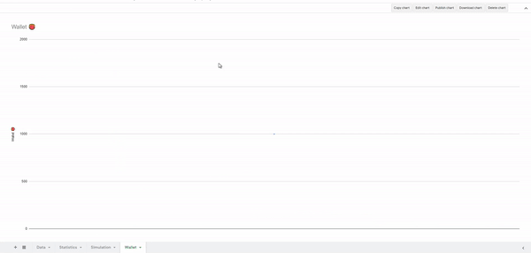

# Bustabit Analyzer

🎲 A [Google Spreadsheet](https://docs.google.com/spreadsheets/d/1w4RSNsScIgSw9AKgqOLl7SrwQMfyAMV0mYi27ALH-hs/edit#gid=0) for studying the statistics of [Bustabit](https://www.bustabit.com/) and analyzing gambling strategies.
`Loader.gs` based on Dexon95 [jsfiddle](https://jsfiddle.net/Dexon95/2fmuxLza/show) and `Crypto.gs` is from Jeff Mott's [Crypto-js](https://code.google.com/archive/p/crypto-js/). 

⚠  **If you continue to gamble despite it negatively impacting your life or wanting to stop, you might be addicted to gambling. In this case, please seek professional help and support groups to beat it.**

📒 *Then he said to them, “Watch out! Be on your guard against all kinds of greed; life does not consist in an abundance of possessions.”* --- Luke 12:15

## Usage:
- Run `loadTable` on `Loader.gs` to load the result of previous games at Data sheet.
- Write a simulation on `Simulation.gs` (see `KellyBettingSimulation` for an example).
- Run the simulation on the editor and see the results in the Wallet sheet.
